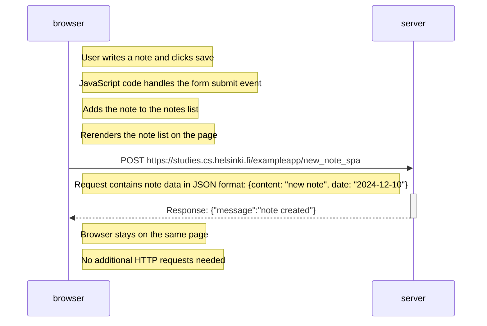

```mermaid
sequenceDiagram
participant browser
participant server

    Note right of browser: User writes a note and clicks save
    Note right of browser: JavaScript code handles the form submit event
    Note right of browser: Adds the note to the notes list
    Note right of browser: Rerenders the note list on the page

    browser->>server: POST https://studies.cs.helsinki.fi/exampleapp/new_note_spa
    Note right of browser: Request contains note data in JSON format: {content: "new note", date: "2024-12-10"}
    activate server
    server-->>browser: Response: {"message":"note created"}
    deactivate server

    Note right of browser: Browser stays on the same page
    Note right of browser: No additional HTTP requests needed
```
