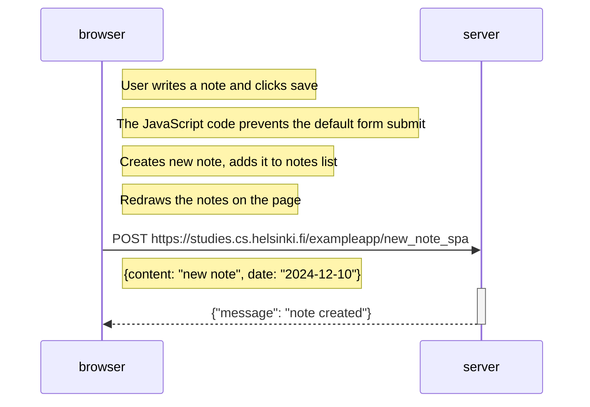

```mermaid
sequenceDiagram
    participant browser
    participant server

    Note right of browser: User writes a note and clicks save
    Note right of browser: The JavaScript code prevents the default form submit
    Note right of browser: Creates new note, adds it to notes list
    Note right of browser: Redraws the notes on the page

    browser->>server: POST https://studies.cs.helsinki.fi/exampleapp/new_note_spa
    Note right of browser: {content: "new note", date: "2024-12-10"}
    activate server
    server-->>browser: {"message": "note created"}
    deactivate server

```
